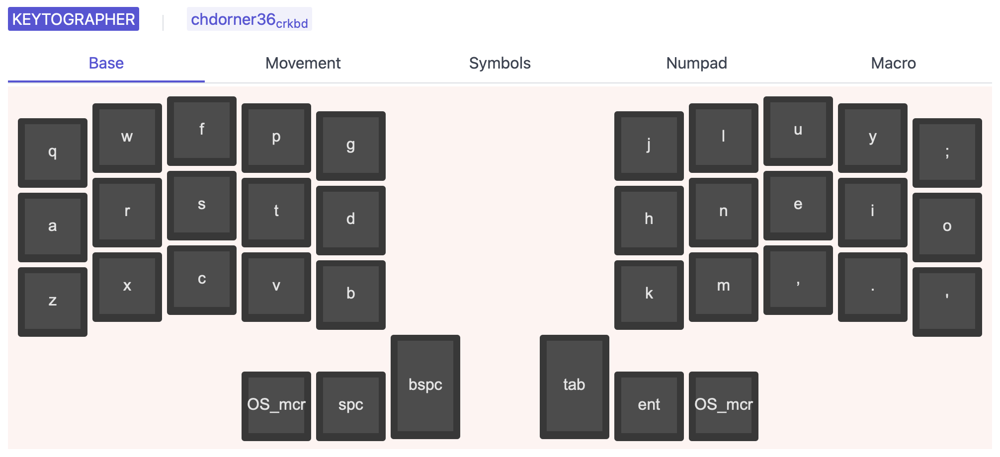

# keytographer


Beautiful keymap visualizations.

> 🚧 Work in progress 🚧
>
> the initial alpha versions are usable but **very** rough around the edges. Use at your own risk!



## Install

### manually / Linux

Download the pre-compiled binaries from the [releases page](https://github.com/chdorner/keytographer/releases) and copy them to the desired location.


### macOS with homebrew

```sh
brew tap chdorner/keytographer
brew install keytographer
```

### Windows with scoop

```sh
scoop bucket add keytographer https://github.com/chdorner/scoop-keytographer.git
scoop install keytographer
```

### go install

This requires the Go toolchain to be installed.

```sh
go install github.com/chdorner/keytographer@latest
```

## Commands

### export
<!-- usage:export:start -->
```
Export a configuration to QMK C keymaps

Usage:
  keytographer export [flags]

Flags:
  -c, --config string   path to the keymap configuration file
  -o, --out string      path to the output file

Global Flags:
  -d, --debug   enable debug mode
```
<!-- usage:export:end -->

### init
<!-- usage:init:start -->
```
Initialize a starting configuration

Usage:
  keytographer init [flags]

Flags:
  -i, --info string       path to the info.json in QMK's repository
  -k, --keyboard string   name of the keyboards
  -l, --layout string     name of the layout macro function
  -o, --out string        path to the keytographer config output file

Global Flags:
  -d, --debug   enable debug mode
```
<!-- usage:init:end -->

### live
<!-- usage:live:start -->
```
Start a live server for easier configuration workflow

Usage:
  keytographer live [flags]

Flags:
  -c, --config string   path to the keymap configuration file
  -H, --host string     host on which to run the live server on (default "localhost")
  -p, --port int        port on which to run the live server on (default 8080)

Global Flags:
  -d, --debug   enable debug mode
```
<!-- usage:live:end -->

### render
<!-- usage:render:start -->
```
Render keymap configuration to SVG files

Usage:
  keytographer render [flags]

Flags:
  -c, --config string   path to the keymap configuration file
  -o, --out string      path to the output directory

Global Flags:
  -d, --debug   enable debug mode
```
<!-- usage:render:end -->

### validate
<!-- usage:validate:start -->
```
Validate keymap configuration

Usage:
  keytographer validate [flags]

Flags:
  -c, --config string   path to the keymap configuration file

Global Flags:
  -d, --debug   enable debug mode
```
<!-- usage:validate:end -->

# License

MIT, see `LICENSE` for more details.
