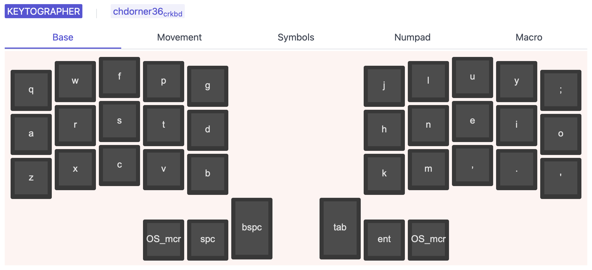

# keytographer

Beautiful keymap visualizations.

> 🚧 Work in progress 🚧
>
> the initial alpha versions are usable but **very** rough around the edges. Use at your own risk!

## Documentation

For information on installing keytographer, configuration and command reference see the documentation at [chdorner.github.io/keytographer](https://chdorner.github.io/keytographer).

# License

MIT, see `LICENSE` for more details.
