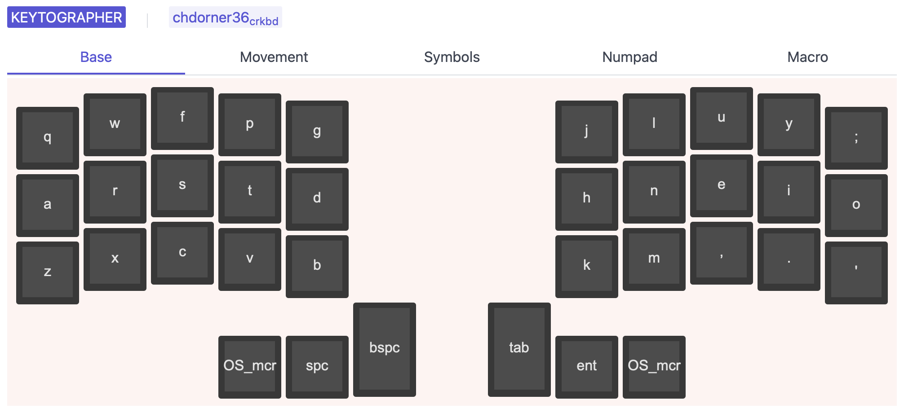

# keytographer

## Beautiful keymap visualizations. <!-- {docsify-ignore} -->

> [!WARNING|label:Work in progress]
> 🚧 The initial alpha versions are usable but **very** rough around the edges. Use at your own risk! 🚧

# License

MIT, see `LICENSE` for more details.
